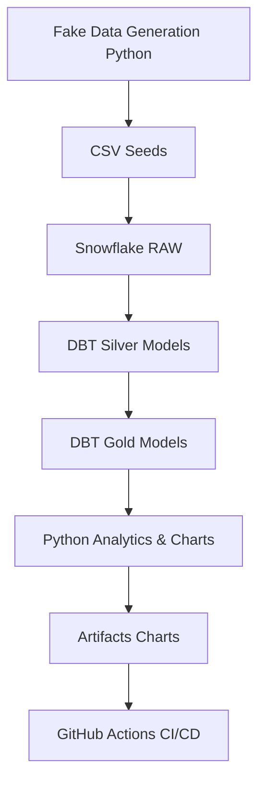

[](https://github.com/Aymane170/FakeSchoolData/actions/workflows/run_analysis.yml)

# FakeSchoolData

---

## 📚 Table of Contents

1. [Project Overview](#project-overview)
2. [Architecture & Data Flow](#architecture--data-flow)
3. [Tech Stack](#tech-stack)
4. [Repository Structure](#repository-structure)
5. [Data Generation](#data-generation)
6. [Data Warehouse & Modeling](#data-warehouse--modeling)
    - [Raw Layer](#raw-layer)
    - [Silver Layer (DBT Models)](#silver-layer-dbt-models)
    - [Gold Layer (Analytics)](#gold-layer-analytics)
7. [Automation & CI/CD](#automation--cicd)
8. [Visualization & Reporting](#visualization--reporting)
9. [How to Run Locally](#how-to-run-locally)
10. [Extending the Project](#extending-the-project)
11. [Troubleshooting](#troubleshooting)
12. [License](#license)

---

## 1. Project Overview

**FakeSchoolData** is a fully automated, end-to-end data engineering project that simulates academic data, loads it into Snowflake, transforms it using dbt, and generates visual insights with Python. All steps are orchestrated and scheduled via GitHub Actions.

**Key Features:**
- Automated fake data generation (students, courses, results)
- Incremental data loading and transformation in Snowflake
- Modular dbt project with raw, silver, and gold layers
- Automated analytics and chart generation
- CI/CD pipeline for daily refresh and reporting

---

## 2. Architecture & Data Flow



1. **Data Generation:** Python script creates and appends new fake data to CSVs.
2. **Ingestion:** CSVs are loaded into Snowflake as raw tables via dbt seeds.
3. **Transformation:** dbt builds Silver (cleaned) and Gold (analytics) models incrementally.
4. **Visualization:** Python script queries Gold models and generates charts.
5. **Automation:** All steps are orchestrated via GitHub Actions.

---

## 3. Tech Stack

- **Languages:** Python 3.10, SQL
- **Python Libraries:** `pandas`, `numpy`, `matplotlib`, `faker`, `snowflake-connector-python`
- **Data Warehouse:** Snowflake
- **Transformation Tool:** dbt (Data Build Tool)
- **CI/CD & Scheduling:** GitHub Actions
- **Visualization:** Python + matplotlib
- **Version Control:** Git

---

## 4. Repository Structure

```
FakeSchoolData/
├── .github/
│   └── workflows/
│       └── run_analysis.yml         # GitHub Actions workflow
├── charts/                          # Auto-generated PNG charts
├── fakeschool_dbt/
│   ├── dbt_project.yml              # dbt project config
│   ├── models/
│   │   ├── silver/                  # Silver (cleaned) models
│   │   │   ├── dim_students.sql
│   │   │   ├── dim_courses.sql
│   │   │   ├── fact_results.sql
│   │   │   └── schema.yml
│   │   └── gold/                    # Gold (analytics) models
│   │       ├── avg_grade_by_course.sql
│   │       ├── avg_grade_by_student.sql
│   │       ├── courses_with_highest_failure_rate.sql
│   │       └── top_students_per_course.sql
│   ├── seeds/
│   │   ├── students.csv
│   │   ├── courses.csv
│   │   └── results.csv
│   └── macros/
│       └── debug_account.sql
├── generate_data.py                 # Data generation script
├── generate_gold_graphs.py          # Chart generation script
├── .gitignore
└── README.md                        # This file
```

---

## 5. Data Generation

- **Script:** `generate_data.py`
- **Purpose:** Incrementally generates new students, courses, and results, appending to CSVs.
- **How it works:**
    - Uses `faker` for realistic French names and dates.
    - Ensures no overwrite: new data is appended.
    - Results are generated for all new students across all courses.
    - CSVs are saved in `fakeschool_dbt/seeds/`.

---

## 6. Data Warehouse & Modeling

### Raw Layer

- **Seeds:** CSVs are loaded as raw tables in Snowflake using dbt seeds.
- **Tables:** `students`, `courses`, `results`

### Silver Layer (DBT Models)

- **Location:** `fakeschool_dbt/models/silver/`
- **Models:**
    - `dim_students.sql`: Cleans and hashes student data.
    - `dim_courses.sql`: Cleans and hashes course data.
    - `fact_results.sql`: Joins students and courses with results, hashes keys.
- **Incremental:** All models are incremental for efficient updates.

### Gold Layer (Analytics)

- **Location:** `fakeschool_dbt/models/gold/`
- **Models:**
    - `avg_grade_by_course.sql`: Average grade per course and year.
    - `avg_grade_by_student.sql`: Average grade per student.
    - `courses_with_highest_failure_rate.sql`: Failure rates by course.
    - `top_students_per_course.sql`: Top student per course.

---

## 7. Automation & CI/CD

- **Workflow:** `.github/workflows/run_analysis.yml`
- **What it does:**
    1. Checks out the repo
    2. Sets up Python and dependencies
    3. Runs data generation
    4. Seeds Snowflake with new data
    5. Runs and compiles dbt models
    6. Runs analytics and generates charts
    7. Uploads charts as workflow artifacts
- **Schedule:** Runs daily at 13:00 UTC and on every push to `main`.

---

## 8. Visualization & Reporting

- **Script:** `generate_gold_graphs.py`
- **How it works:**
    - Connects to Snowflake using environment variables.
    - Executes Gold SQL models.
    - Generates and saves charts in `charts/`:
        - Average grade by course/year (bar chart)
        - Top 10 students by average grade (bar chart)
        - Top 10 courses with highest failure rate (bar chart)
        - Top student per course (bar chart)
    - Charts are zipped and uploaded as workflow artifacts.

---

## 9. How to Run Locally

### Prerequisites

- Python 3.10+
- dbt-core & dbt-snowflake
- Snowflake account (with credentials)
- Git

### Steps

1. **Clone the repo:**
    ```sh
    git clone https://github.com/Aymane170/FakeSchoolData.git
    cd FakeSchoolData
    ```

2. **Install dependencies:**
    ```sh
    pip install pandas numpy matplotlib faker snowflake-connector-python dbt-core dbt-snowflake
    ```

  **Note :
  If you encounter issues running dbt or installing dependencies, try using a Python virtual environment:
    ```sh
    python -m venv venv       # On Windows
    venv\Scripts\activate  
    ```     
    or

    ```sh
    source venv/bin/activate  # On macOS/Linux
    ```

3. **Configure Snowflake credentials:**
    - Set environment variables or edit `~/.dbt/profiles.yml` as in the workflow.

4. **Generate data:**
    ```sh
    python generate_data.py
    ```

5. **Seed and run dbt models:**
    ```sh
    cd fakeschool_dbt
    dbt seed --full-refresh
    dbt run --full-refresh
    ```

6. **Generate charts:**
    ```sh
    python ../generate_gold_graphs.py
    ```
---

**Author:**
Aymane RAMI  
*Data & Software Engineering Enthusiast*